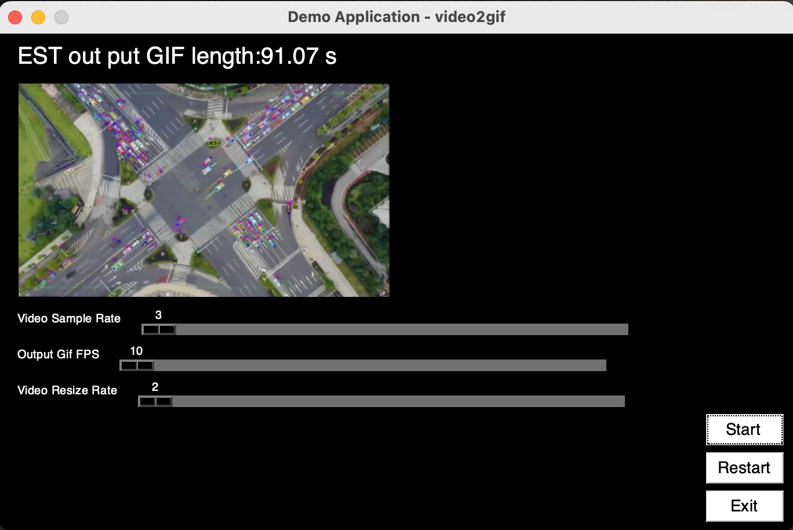

# video2gif

Programmatically generate animated GIF from video in Python

With this video2gif converter you can upload any format of video and rich media files to turn them into high quality animated GIFs. 

## Requirements

Python 3.6+, pysimplegui,opencv-python and other common packages listed in `requirements.txt`.
## Getting Started
#### 1. Install
* pip Install
   ```shell
   pip install vgif -U
   ```
* source Install
   1. Clone this repository
   2. Run setup from the repository root directory
   ```bash
    python3 setup.py install
   ```
#### 2. Start UP
##### 🅶 GUI
   1. Start interface
       ```shell
       vgif-gui
       ```
       
   2. Select video file
   3. Set options
   4. Click button "Start" to start
   5. Once started converter will save the output under the same folder ad source video
   6. Click button "ReStart" to re-start this process
   7. Click button "Exit" to end this program.
   
   The options includes:
      * Video Sample Rate:Set sample rate for the source video (default sample every 10 frame)
      * Output GIF FPS: Set output GIF fps(default 10 fps)
      * Video Resize Rate: Shrink video n times smaller (default 2 times smaller)

##### 🅲 CMD
   * Usage:
     ```shell
     vgif [OPTIONS]
   
        Converts video to GIF.
   
     Options:
        -i, --input PATH         input video file
        -o, --output TEXT        output gif file path and name.
        -s, --scale INTEGER      Scale the factor for frame_x and frame_y.
        -r, --resolution TEXT    The resolution factor for factor ( For Compress ),
                          like 1920x1080.
   
        -fps, --gif-fps INTEGER  The fps of the GIF.
        --help                   Show this message and exit.
     ```
   *  Just Give the Input:
      ```python
      vgif -i /myLocalDir/myVideo.mov
      ```
      _This will generate the GIF with the same name to the same directory as the original file._


   * Give the file path for out.:
      ```python
      vgif -i /myLocalDir/myVideo.mov -o /some_dir/out.gif
      ```

## Development & Contribution 

1. Clone this repository
2. Install dependencies
   ```bash
   pip3 install -r requirements.txt
   ```


## Citation
Use this bibtex to cite this repository:
```
@misc{ouzheng1993,
  title={video2gif},
  author={ou zheng},
  year={2020},
  publisher={Github},
  journal={GitHub repository},
  howpublished={\url{https://github.com/ozheng1993/video2gif}},
}
```
## To do

- [ ] GIF Size
- [ ] file output
- [ ] Improve compression ratio and reduce generation size. 

## Contributing
Contributions to this repository are welcome. Examples of things you can contribute:
* update README
* update user interface
